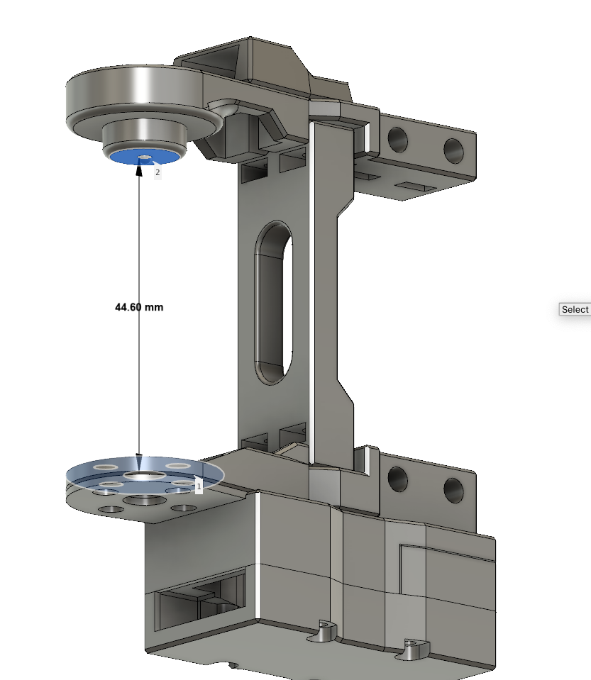
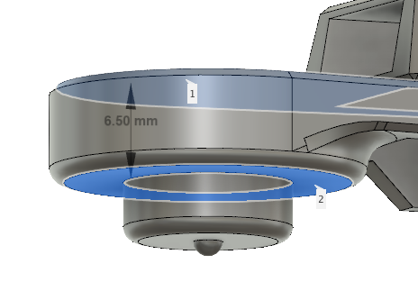

# Changes for DS3250 PRO servos

The distance between Coxa sides needs to be increased by 
height of the motor with metal round horn - 45.9mm
We need to increase visible distance to 45.9mm+1mm->46.9 (small distancer in the cetre is 1mm)
This distance will be increased by 46.9-44.6=2.3mm

We will achieve this by modifing above distance to 6.5-2.3=4.2mm.

